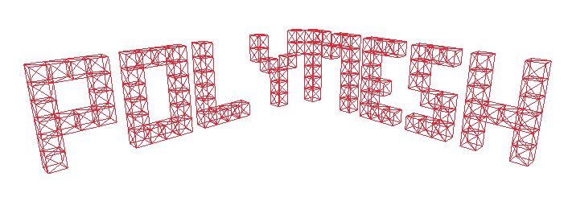

 [](https://crates.io/crates/libpolymesh) [](https://docs.rs/libpolymesh)

PolyMesh is a custom 3D object description file format I designed as an experiment. The PolyMesh file format and toolset are specifically designed for 3D rendering applications.

The PolyMesh file format (`pmf`) is a gzip file containing a structured directory tree of JSON files. Each level of the tree contains a descriptor `polymeta.json` file, which describes the directory. The lowest level directories all contain `mesh.json` files, which describe a 3D mesh using a collection of basic polygons. Each level of a PolyMesh file should be thought of as its own 3D mesh. Higher level meshes can include lower level meshes to build more complex meshes.

All meshes are relatively positioned. This means that the lowest level meshes should all be centered on `[0,0,0]` so that higher level meshes can include them and transform them as needed. PolyMesh files can be packed and unpacked using the `pmfpack` and `pmfextract` tools. When a PolyMesh is unpacked, it can be re-packed at a lower level, which is why it is important to keep all meshes relatively positioned. A PolyMesh that describes a cafe scene can also be re-packed to only describe a coffee cup that would be on a table in the main scene.

*An example 3D object is available in [`example_meshes/default_cube`](example_meshes/default_cube)*

## The toolset

This repository provides a few CLI tools for working with PolyMeshes:

 - [`pmfpack`](tools/pmfpack) [](https://crates.io/crates/pmfpack)
   - Can pack an uncompressed directory (like the `default_cube` example) into a single `.pmf` file
 - [`pmfextract`](tools/pmfextract) [](https://crates.io/crates/pmfextract)
   - Can unpack a `.pmf` file into an uncompressed directory
 - [`pmftree`](tools/pmftree) [](https://crates.io/crates/pmftree)
   - Provides a visualization of any `.pmf` file in a style similar to the `tree` command
 - [`pmfview`](tools/pmfview) [](https://crates.io/crates/pmfview)
   - A full 3D visualizer for any `.pmf` file. Inspired by Pixar's `usdview`. Built on [raylib](https://github.com/raysan5/raylib)
 - [`vox2pmf`](tools/vox2pmf) [](https://crates.io/crates/vox2pmf)
   - A tool that can convert files from the `.vox` format to a PolyMesh
 - [`pmfcube`](tools/pmfcube) [](https://crates.io/crates/pmfcube)
   - A debugging tool that will generate a colored cube at `[0,0,0]` with the size of 1 unit

## The library

[`libpolymesh`](libpolymesh) is available for use as its own separate Rust library, and is currently a work-in-progress.

## A note on coordinates

This project shouldn't actually care which coordinate system is used, but I program it using the "Y-up, right-handed" rule.

## Building

This monorepo has a few system dependencies:

```sh
# Install GUI libraries
sudo apt install libasound2-dev mesa-common-dev libx11-dev libxrandr-dev libxi-dev xorg-dev libgl1-mesa-dev libglu1-mesa-dev

# Install the workspace wrangling tools
cargo install cargo-token
cargo install cargo-unleash --version 1.0.0-alpha.11
cargo install cargo-watch https
```

Building is done with:

```sh
cargo build --all
```

### Publishing

The following command is used to auto-publish the entire workspace:

```sh
cargo unleash em-dragons --token $(cargo token)
```